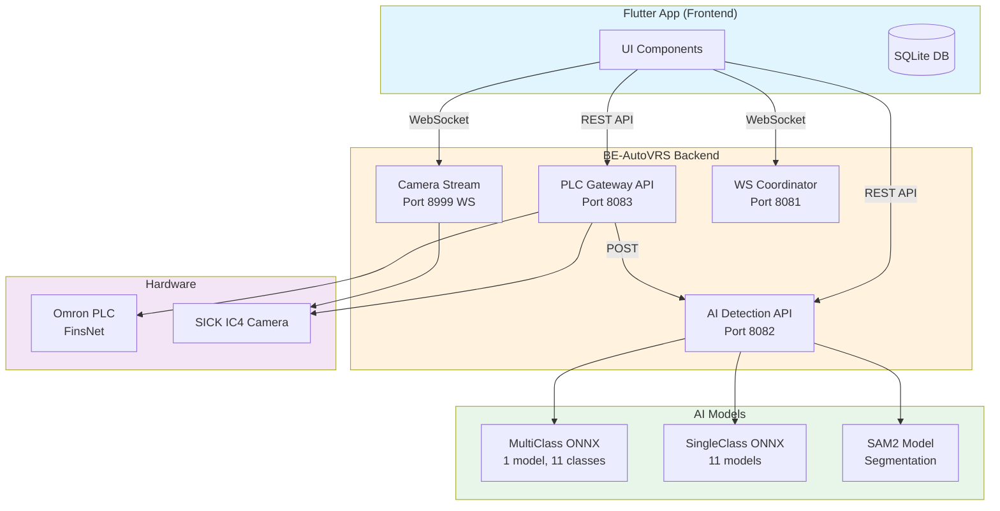
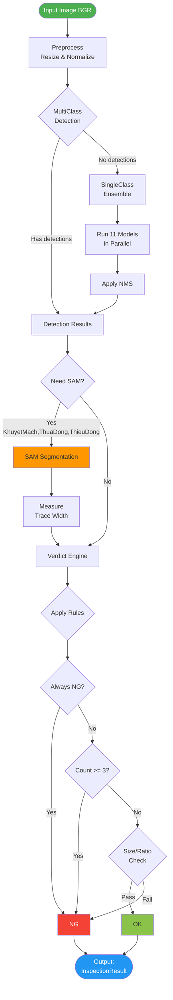
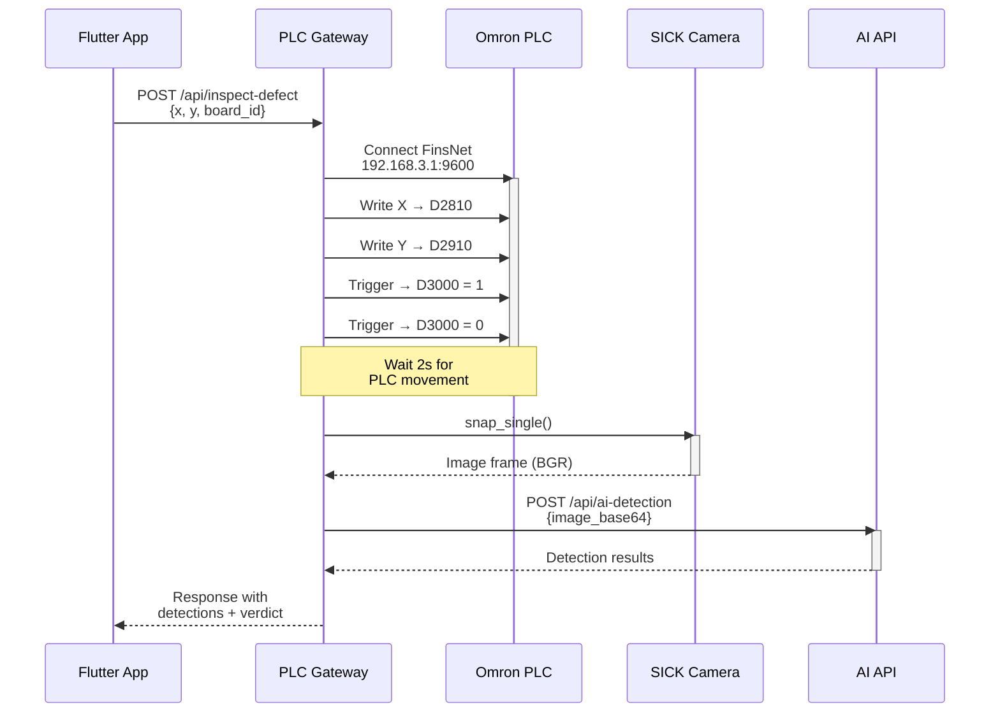
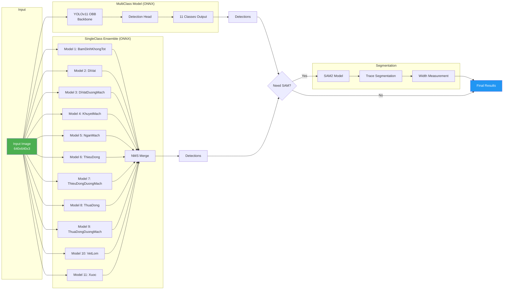
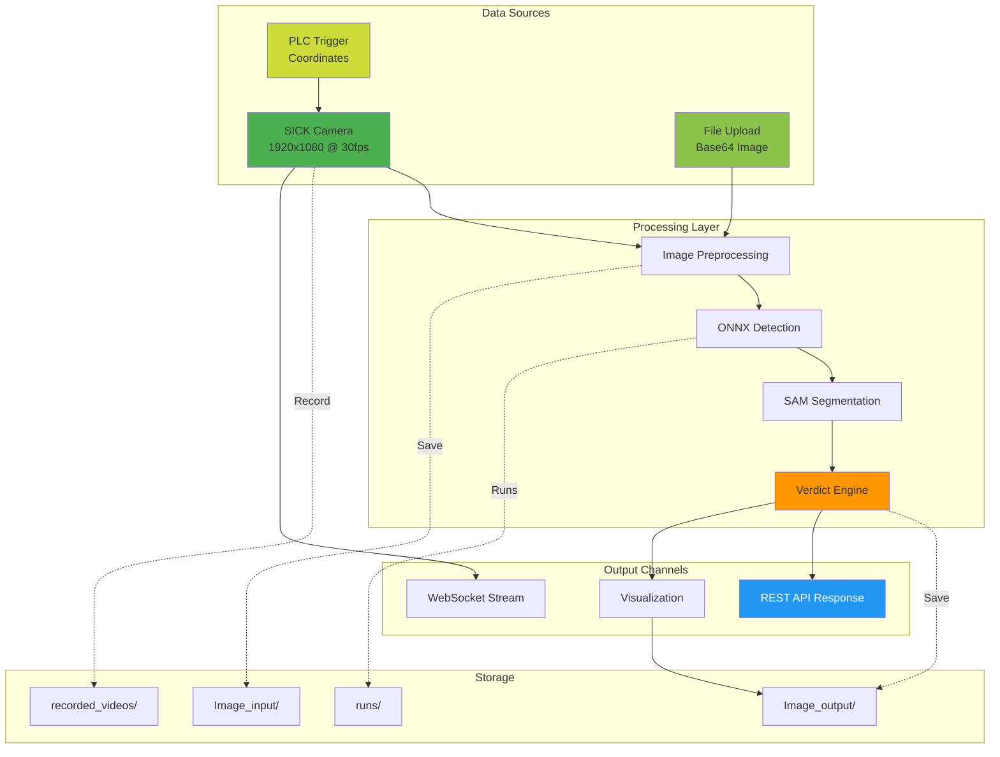
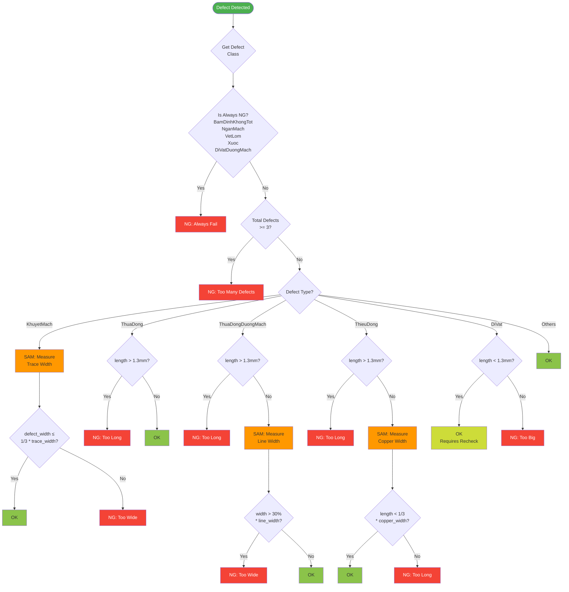
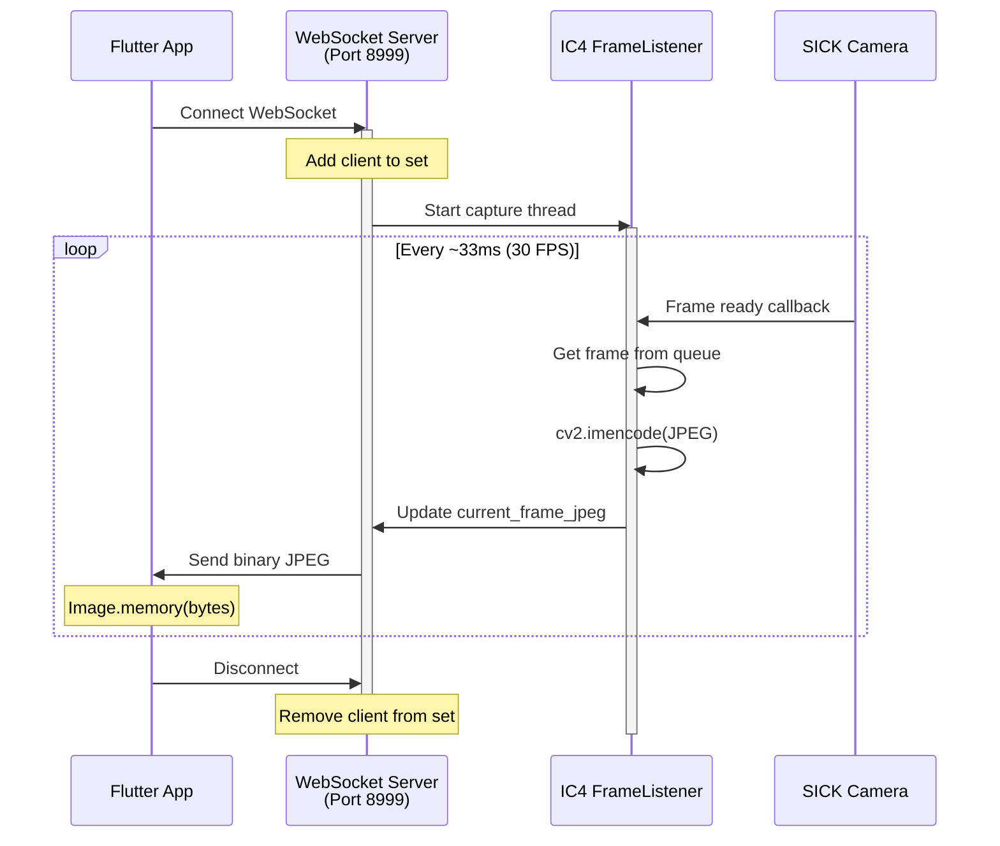
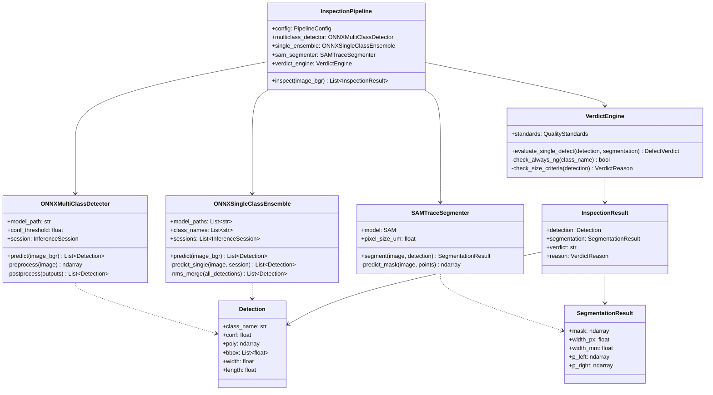
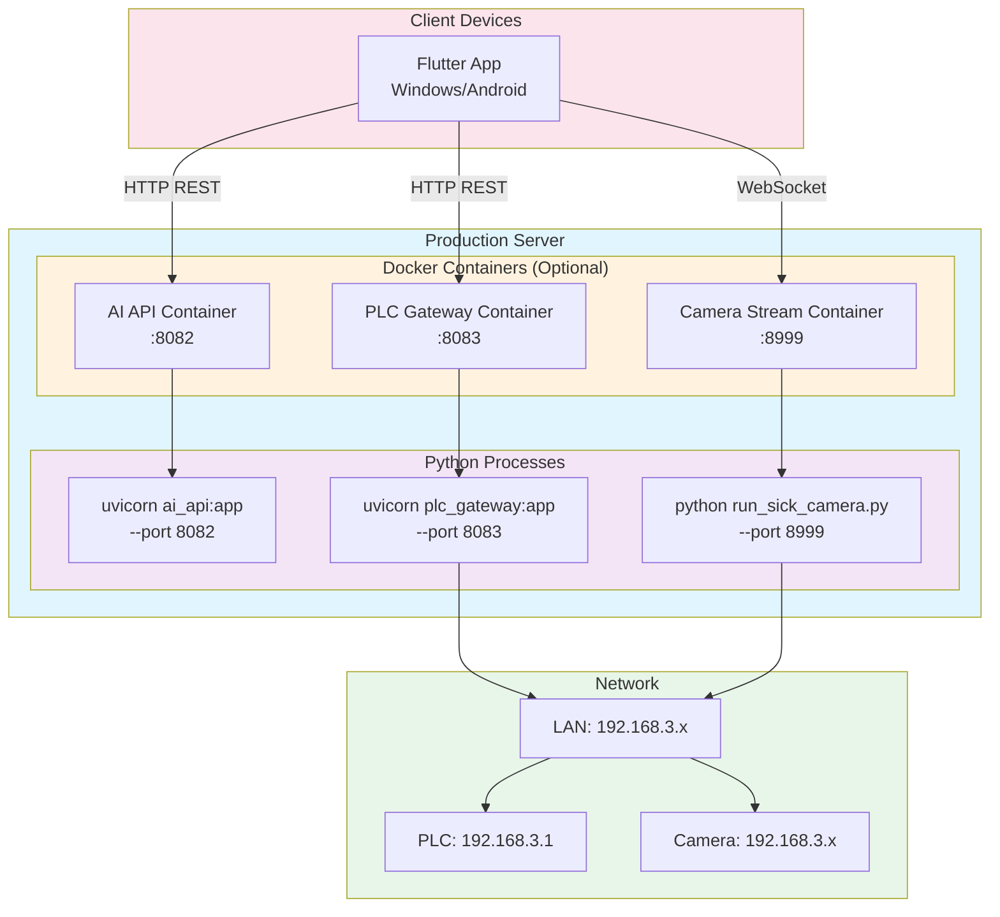

# BE-AutoVRS System Diagrams

## 1. Overall System Architecture

## 2. AI Detection Pipeline Flow

## 3. PLC Gateway Workflow

## 4. AI Model Architecture

## 5. Data Flow Architecture

## 6. Verdict Engine Decision Tree

## 7. SICK Camera Stream Architecture

## 8. Class Diagram - Core Components

## 9. Deployment Architecture

---

## Legend

- 🟢 **Green**: Input/Start points
- 🔵 **Blue**: Output/End points
- 🟠 **Orange**: Processing/Critical steps
- 🔴 **Red**: Failure/NG states
- 🟡 **Yellow**: Warning/Special cases
